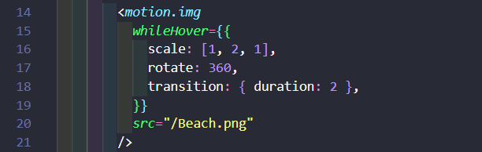

# Framer Motion

The project was to use framer motion to animate the three images. It was done with the following features: scale, rotation and opacity.

## Image 1 - Scale and rotate.


For the first image of the beach I used the motion scale and rotate. For the rotation i made it go 360 degress. As it rotated I make it scale bigger and back to original size.

## Image 2 - Springing Image

I made the image bounce in scale. Below is the code with useSpring that gives the image the bounce effect.

```jsx
const spring = useSpring(0, { stiffness: 300, damping: 15 });
```

The `useSpring` function takes two parameters. The first parameter is a number. This represents the current value of the animation. If you pass `0`, it will start from zero and animate to its final value (which is set Stiffness and dampning). The second argument is an object where you can define how your animation should behave. In this case I used `{stiffness: 300, damping: 15}

## Image 3 - Opacity

The opacity property was used to make the image fade in and out.

```jsx
<motion.img whileHover={{ opacity: [1, 0, 1] }} transition={{ duration: 1 }} />
```

This allows the image to fade in and out.

## Documentation

    [Framer Motion Docs - Github](https://www.framer.com/api/)

I followed the documentation provided in order to create this animation. It was very helpful, especially when it came to using the `whileHover`. This animation was created with the following options for the animation that will be animated.

I followed the documentation provided in order to create this animation. It was very helpful and easy to understand.

---

This is a [Next.js](https://nextjs.org/) project bootstrapped with [`create-next-app`](https://github.com/vercel/next.js/tree/canary/packages/create-next-app).

## Getting Started

First, run the development server:

```bash
npm run dev
# or
yarn dev
# or
pnpm dev
# or
bun dev
```

Open [http://localhost:3000](http://localhost:3000) with your browser to see the result.

You can start editing the page by modifying `app/page.js`. The page auto-updates as you edit the file.

This project uses [`next/font`](https://nextjs.org/docs/basic-features/font-optimization) to automatically optimize and load Inter, a custom Google Font.

## Learn More

To learn more about Next.js, take a look at the following resources:

- [Next.js Documentation](https://nextjs.org/docs) - learn about Next.js features and API.
- [Learn Next.js](https://nextjs.org/learn) - an interactive Next.js tutorial.

You can check out [the Next.js GitHub repository](https://github.com/vercel/next.js/) - your feedback and contributions are welcome!

## Deploy on Vercel

The easiest way to deploy your Next.js app is to use the [Vercel Platform](https://vercel.com/new?utm_medium=default-template&filter=next.js&utm_source=create-next-app&utm_campaign=create-next-app-readme) from the creators of Next.js.

Check out our [Next.js deployment documentation](https://nextjs.org/docs/deployment) for more details.
